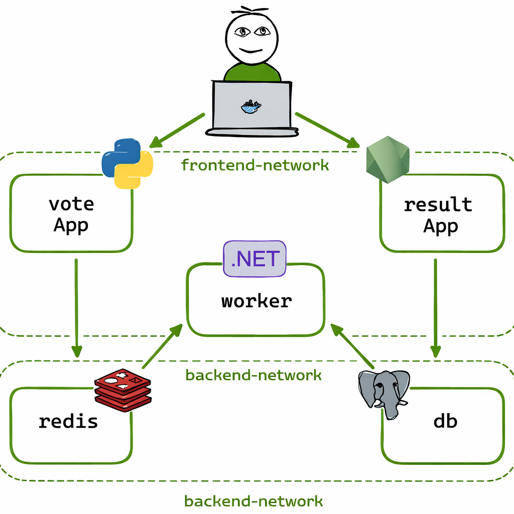

# 🗳️ Docker Voting App

A distributed voting application running across multiple Docker containers.
It demonstrates how to orchestrate services in Docker using Compose.

## 📂 Architecture
The app is composed of several services, each running in its own container:



- Frontend (`vote`): Python web app for casting votes (http://localhost:5000)
- Redis (`redis`): Message queue to collect votes
- Worker (`worker`): .NET service that consumes votes and stores them in Postgres
- Postgres (`db`): Database for persisting votes
- Result (`result`): Node.js web app showing live results (http://localhost:5001)

### 🕸️ Docker Networks
This stack uses two overlay networks in `docker-compose.yml`:

- `frontend-network`:
  - `vote`
  - `result`
- `backend-network`:
  - `redis`
  - `db`
  - `worker`
  - `vote`
  - `result`

`vote` and `result` are attached to both networks to bridge frontend traffic and backend data flow.

## 🛠️ Prerequisites

- Install Docker
- Ensure Docker Compose is available

## 🚀 Running with Docker Compose

### Clone the repository:

```bash
git clone https://github.com/your-username/example-voting-app.git
cd example-voting-app
```

### Start the app:

```bash
docker compose up
```

### Access the services:

- Voting frontend: http://localhost:5000
- Results dashboard: http://localhost:5001

### Stop the app:

```bash
docker compose down
```
## 📦 Docker Images

Each service has its own Dockerfile:

- `vote/` → Python app
- `result/` → Node.js app
- `worker/` → .NET worker
- `postgres` and `redis` use official images from Docker Hub

## 🔧 Notes

- Each browser client can only vote once.
- This is a demo project showcasing container orchestration with Docker Compose.


## 📜 License

Licensed under Apache-2.0.
